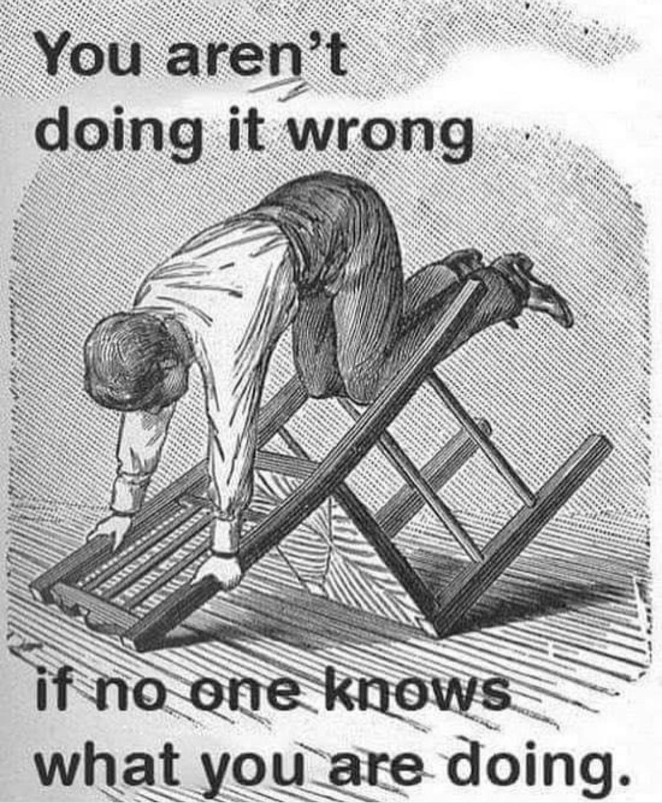
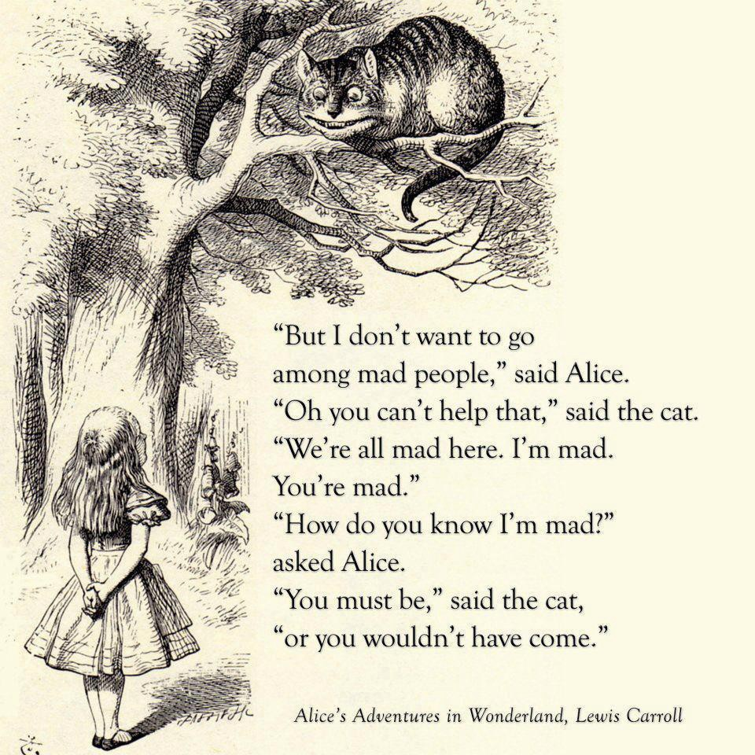

<!--
Once upon a time, in a faraway land, people lived a simple life. They looked out over a pasture and said: 'Oh, look, a cow. And there: a horse. Even small children knew what a horse and a cow looked like. 
On a whim, the emperor of this land decided to confuse his people and issued a decree that a cow could also be a horse. And a horse could be a cow.  
At first, the people shook their heads in amusement. Why should a cow be a horse? They look completely different! Even a small child knows that. 
But gradually more and more citizens began to wonder: maybe there was something to this decree after all. If the Emperor says a horse can be a cow and a cow can be a horse, how can we know any better? After all, he is our Emperor. A man of much greater wisdom than we are. He must know better, or he wouldn't be our emperor.  
And so it came to pass that fewer and fewer citizens could believe their own eyes. When they looked at the pasture and saw a cow, they said: "It's not at all certain that it's a cow. It might as well be a horse. And when a neighbour replied: "Nonsense, it's a cow, you can see that! They turned away in disgust, doubting his sanity.  
When the emperor saw this, he nodded in satisfaction. He went into his palace and laughed and laughed.

©Vince Ebert.
-->

<!--

  

-->

<!--
In the desert 
I saw a creature, naked, bestial, 
Who, squatting upon the ground, 
Held his heart in his hands, 
And ate of it. 
I said, “Is it good, friend?” 
“It is bitter—bitter,” he answered; 

“But I like it 
“Because it is bitter, 
“And because it is my heart.” 
-->

<!--

  

-->

<!--
Oh there was a sow who had three little pigs, 
There little piggies had she. 
The old sow always went "oink, oink, oink," 
and the piggies went "wee, wee, wee-ee-ee."
      
Now one day one of the three little pigs 
To the other two piggies said he, 
"Why don't we always go oink, oink, oink? 
It's so childish to go wee, wee, wee-ee-ee!"    

These three piggies grew skinny and lean, 
Skinny they well should be, 
For they always would try to go "oink, oink, oink," 
And they wouldn't go "wee, wee, wee-ee-ee."
      
Now there three piggies they up and they died. 
A very sad sight to see. 
So don't ever try to go "oink, oink, oink," 
When you oughta go "wee, wee, wee-ee-ee!"
-->

<!--
**Yuri05/Yuri05** is a ✨ _special_ ✨ repository because its `README.md` (this file) appears on your GitHub profile.

Here are some ideas to get you started:

- 🔭 I’m currently working on ...
- 🌱 I’m currently learning ...
- 👯 I’m looking to collaborate on ...
- 🤔 I’m looking for help with ...
- 💬 Ask me about ...
- 📫 How to reach me: ...
- 😄 Pronouns: ...
- ⚡ Fun fact: ...
-->
